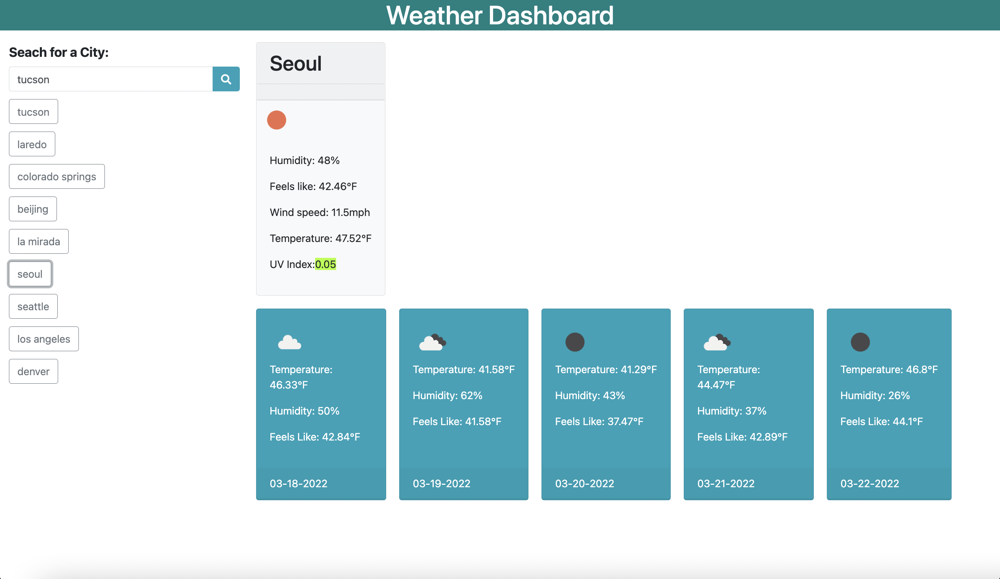

# Weather-Dashboard

## Overview

Third-party APIs allow to access their data and functionality by making requests with specific parameters to a URL. The weather dashboard is built so that it runs in the browser and feature updated HTML and CSS.
It also uses the OpenWeather One Call API to retrieve weather data for cities.

## Screenshot

## Resources

- https://github.com/zionremnant/Weather-Dashboard
- https://zionremnant.github.io/Weather-Dashboard/
